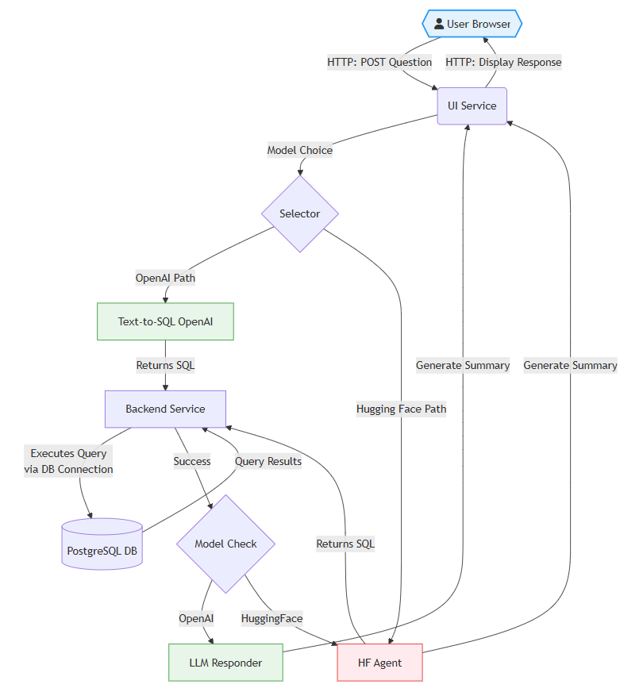
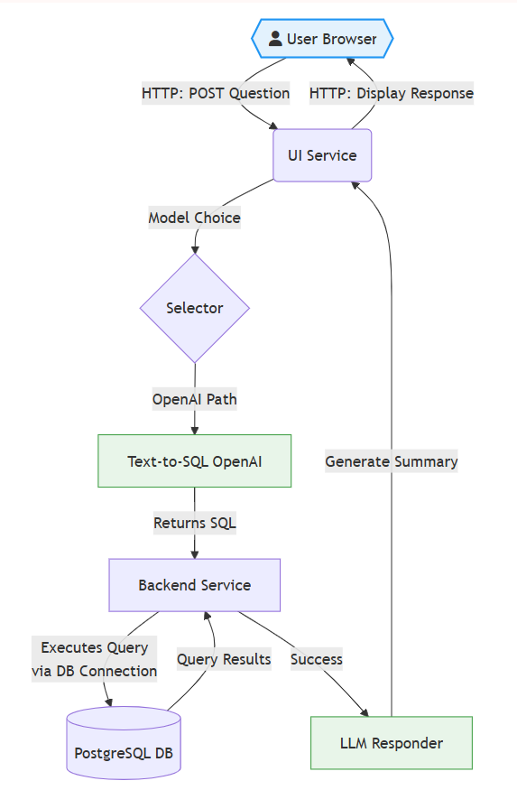
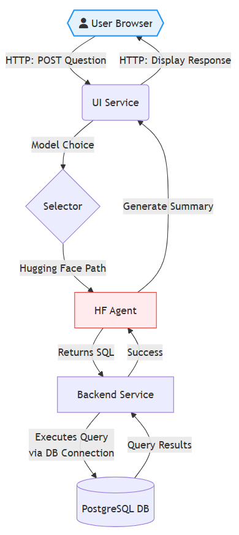
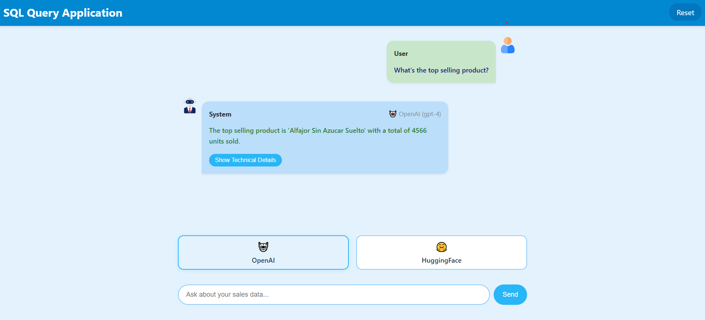

# Sales Analytics Conversational Interface

A microservices-based application that enables natural language interaction with sales data through SQL generation powered by AI models.

## 🚀 Project Overview

**Core Concept**: Transform natural language questions into actionable SQL insights using AI models (OpenAI GPT-4/Hugging Face Gemma) with a chat-style interface.

### Key Features
- Dual AI backend support (OpenAI + Hugging Face)
- Automatic SQL query generation
- Results visualization with technical details toggle
- Error resilience with fallback handling
- Dockerized microservices architecture

## 🧩 Main Components

| Service | Tech Stack | Function |
|---------|------------|----------|
| **PostgreSQL** | PostgreSQL 14 | Stores sales data with preloaded CSV |
| **Backend** | Python/Flask | SQL query execution API |
| **Text-to-SQL** | FastAPI/OpenAI | Natural language to SQL translation |
| **LLM Responder** | Flask/OpenAI | Results summarization in natural language |
| **HF Agent** | Flask/HuggingFace | Open-source alternative for text-to-SQL and summarization |
| **Web UI** | Flask/HTML/CSS | Interactive chat interface with model switching |

## 📐 Architecture Flow

### Overview
  
*Complete system flow diagram*

The system follows a microservices-based architecture where each component has a clear responsibility. The main flow starts with user interaction and branches based on the selected model (OpenAI or Hugging Face).

### Detailed Subflows

#### OpenAI Flow
  
*Specific flow for OpenAI*

1. User submits a question
2. UI Service selects OpenAI
3. Text-to-SQL generates the query
4. Backend executes the query
5. LLM Responder generates the summary
6. UI displays the response

#### Hugging Face Flow
  
*Specific flow for Hugging Face*

1. User submits a question
2. UI Service selects Hugging Face
3. HF Agent generates the SQL query
4. Backend executes the query
5. HF Agent processes the results
6. UI displays the response

### Key Differences
- **OpenAI**: Uses two separate services (Text-to-SQL and LLM Responder)
- **Hugging Face**: A single service (HF Agent) handles both functions
- **Backend**: Shared for query execution
- **UI**: Same entry point for both flows
## 🛠️ Getting Started

### Prerequisites
- Docker 20.10+
- Docker Compose 2.20+
- OpenAI API key (for GPT-4 features)
- Hugging Face token (for open-source model)

### Installation Guide

#### 1. Clone Repository
```bash
git clone https://github.com/jscorza/SQL_Agent_App.git
cd sales-analytics-chat
```

#### 2. Prepare Data File
**- All OS:**
1. Create `data` folder in project root
2. Add your CSV file as `data/data.csv` 


#### 3. Configure Environment
**- Linux/Mac:**
```bash
echo "OPENAI_API_KEY=your_key_here
HF_API_TOKEN=your_hf_token_here
DB_USER=myuser
DB_PASSWORD=mypassword
DB_NAME=mydatabase" > .env
```

**- Windows:**
1. Create `.env` file manually in project root
2. Add these contents:
```ini
OPENAI_API_KEY=your_key_here
HF_API_TOKEN=your_hf_token_here
DB_USER=myuser
DB_PASSWORD=mypassword
DB_NAME=mydatabase
```

#### 4. Start Containers
```bash
docker-compose up --build
```

#### 5. Access Application
```
http://localhost:8080
```

---


## 🔄 Typical Workflow
1. User asks "What's the top selling product?"
2. System generates appropriate SQL
3. Query executes against PostgreSQL
4. Results summarized in natural language
5. Technical details available via toggle



## 📋 Example Questions Explorer  
- What is the most bought product on Fridays?  
- Which product had the biggest single ticket sale in terms of ‘total’?  
- Which waiter served the most customers?  
- Which day of the week has the highest sales volume?  
- how many prodcuts i have in my database?  
- how much money did we made on each year?  
- Which product generated the most revenue?  
- Which product is the most sold overall?  
- what are the top 3 products on total revenue only on mondays?  
- Which product has the greatest total revenue for a single day?  
- what are the 5 least bought products on weekends?  
- Find the total money spent (sum of total) by day of week, but only for product_name = 'Alfajor Vegano x un'?  
- How many distinct ticket_number entries are there in total?  
- What is the average unitary_price of all products sold?  
- How many rows are in the sales table?  
- Which hour of Friday has the greatest quantity sold?  


---
---
*by juaniscorza* 
  
